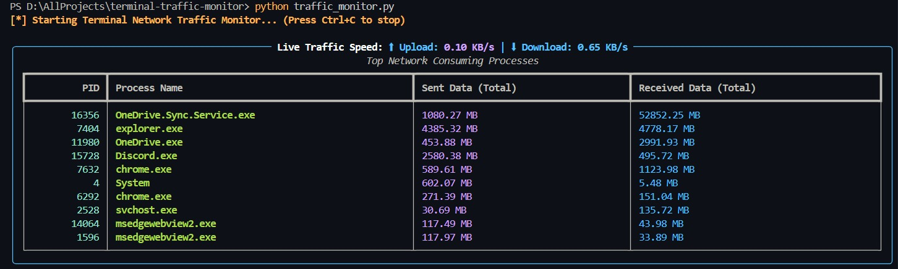

# Terminal Network Traffic & Bandwidth Monitor 

A real-time CLI network monitoring tool built with Python. It tracks active system processes consuming network bandwidth, calculates live upload/download speeds, and logs usage history to a local SQLite database—all through an interactive terminal dashboard.

---

## Key Features

- **Real-Time Bandwidth Tracking:** Displays active live upload and download speeds.
- **Per-Process Network Usage:** Identifies top processes (`PID`, `Name`, and data transferred).
- **Interactive Terminal UI:** Built with `Rich` for clean, responsive visualization.
- **Local SQLite Logging:** Automatically stores process usage snapshots locally (`network_traffic.db`).
- **100% Offline & Private:** Runs entirely locally without external APIs or cloud dependencies.

---

## Tech Stack

- **Python 3.x**
- **[psutil](https://github.com/giampaolo/psutil):** Process and system monitoring utilities.
- **[Rich](https://github.com/Textualize/rich):** Terminal formatting and live interactive dashboards.
- **SQLite3:** Embedded database for local traffic history persistence.

---

## Screenshot


## Installation & Usage

1. **Clone the repository:**
   ```bash
   git clone [https://github.com/YOUR_USERNAME/terminal-traffic-monitor.git](https://github.com/YOUR_USERNAME/terminal-traffic-monitor.git)
   cd terminal-traffic-monitor

2. **Install dependencies:**   
    pip install psutil rich

3. **Run the monitor:**
    python traffic_monitor.py

   (Press Ctrl + C at any time to exit the live view and flush logs).
